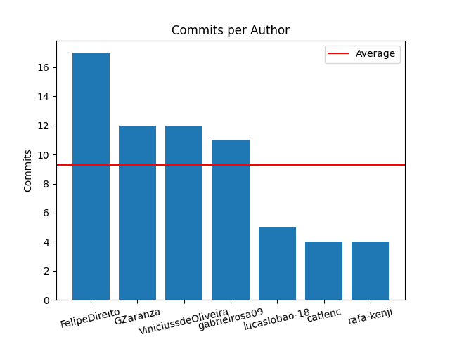

## Report from 06-06-2023 - 07-05-2023

## File Extensions Report by Author

## Author: gabrielrosa09 

| Extension / Files |
| -------- | 
| **md** | 
 docs/architecture_document.md| 
docs/vision_document.md| 
arquivo_title.md| 
arquivo_title.md| 
README.md | 
| **py** | 
 src/check_extension.py| 
src/commit_data.py| 
src/title_commits.py| 
src/main.py| 
src/title_commits.py| 
src/commit_data.py| 
src/gitInfo.py| 
src/grafico_issues.py| 
src/commit_palavra.py| 
src/main.py| 
src/main.py| 
src/title_commits.py| 
src/title_commits.py | 
| **yml** | 
 .github/workflows/pylint.yml | 
| **txt** | 
 allcommits.txt| 
emailcommits.txt| 
src/requirements.txt | 

## Author: FelipeDireito 

| Extension / Files |
| -------- | 
| **py** | 
 src/gitInfo.py| 
src/main.py| 
src/gitInfo.py| 
src/main.py| 
src/gitInfo.py| 
src/gitInfo.py| 
src/main.py| 
src/gitInfo.py| 
src/grafico_issues.py| 
src/average_commit.py| 
src/coauthor.py| 
src/gitInfo.py| 
src/main.py| 
src/verificar_tipo_arquivo.py | 
| **md** | 
 src/arquivo.md| 
src/relatorio_geral.md | 
| **yml** | 
 .github/workflows/pylint.yml| 
.github/workflows/pylint.yml| 
.github/workflows/pylint.yml| 
.github/workflows/pylint.yml| 
.github/workflows/pylint.yml| 
.github/workflows/pylint.yml| 
.github/workflows/pylint.yml| 
.github/workflows/pylint.yml| 
.github/workflows/pylint.yml| 
.github/workflows/pylint.yml| 
.github/workflows/pylint.yml | 
| **txt** | 
 src/requirements.txt| 
src/allcommits.txt| 
src/emailcommits.txt| 
src/requirements.txt | 

## Author: GZaranza 

| Extension / Files |
| -------- | 
| **py** | 
 src/gitInfo.py| 
src/gitInfo.py| 
src/main.py| 
src/gitInfo.py| 
src/gitInfo.py| 
src/main.py| 
src/main.py| 
src/title_commits.py| 
src/gitInfo.py| 
src/main.py| 
src/gitInfo.py| 
src/main.py| 
src/commit_data.py| 
src/gitInfo.py| 
src/grafico_issues.py| 
src/grafico_issues.py | 
| **md** | 
 arquivo.md| 
arquivo.md| 
arquivo_data.md| 
arquivo_title.md | 
| **python** | 
 tempCodeRunnerFile.python| 
tempCodeRunnerFile.python| 
tempCodeRunnerFile.python | 
| **txt** | 
 allcommits.txt| 
allcommits.txt| 
emailcommits.txt | 

## Author: lucaslobao-18 

| Extension / Files |
| -------- | 
| **py** | 
 src/gitInfo.py| 
src/main.py| 
src/gitInfo.py| 
src/main.py| 
src/gitInfo.py| 
src/main.py| 
src/main.py| 
src/main.py| 
src/title_commits.py | 
| **md** | 
 src/arquivo.md| 
src/relatorio_geral.md | 

## Author: ViniciussdeOliveira 

| Extension / Files |
| -------- | 
| **py** | 
 src/gitInfo.py| 
src/gitInfo.py| 
src/gitInfo.py| 
src/gitInfo.py| 
src/gitInfo.py| 
src/gitInfo.py| 
src/main.py| 
src/title_commits.py| 
src/gitInfo.py| 
src/main.py| 
src/gitInfo.py| 
src/main.py| 
src/commit_palavra.py| 
src/main.py| 
geradorrelatorio/average_commit.py| 
geradorrelatorio/verificar_tipo_arquivo.py| 
src/average_commit.py| 
src/coauthor.py| 
src/commit_palavra.py| 
src/gitInfo.py| 
src/main.py| 
src/verificar_tipo_arquivo.py| 
geradorrelatorio/main.py| 
geradorrelatorio/verificar_tipo_arquivo.py | 
| **gitignore** | 
 .gitignore | 
| **md** | 
 arquivo.md| 
arquivo.md | 
| **txt** | 
 geradorrelatorio/requirements.txt| 
src/allcommits.txt| 
src/emailcommits.txt| 
src/requirements.txt | 

## Author: catlenc 

| Extension / Files |
| -------- | 
| **py** | 
 src/gitInfo.py| 
src/title_commits.py| 
src/commit_data.py| 
src/commit_palavra.py| 
src/main.py | 

## Author: rafa-kenji 

| Extension / Files |
| -------- | 
| **txt** | 
 allcommits.txt| 
src/requirements.txt| 
allcommits.txt| 
emailcommits.txt | 
| **md** | 
 arquivo_data.md| 
arquivo_title.md | 
| **py** | 
 src/gitInfo.py| 
src/main.py| 
src/commit_data.py| 
src/commit_data.py | 
| **python** | 
 tempCodeRunnerFile.python | 
| **yml** | 
 .github/workflows/pylint.yml | 

## List of commits with coauthor

| Hash | Author | Coauthor |
|------|--------|----------|
|1638db|GZaranza|['Vinicius de Oliveira ']|
|718b52|lucaslobao-18|['Catlen Oliveira ']|
|bf6229|Vinicius de Oliveira Santos|['Gabriel Zaranza ']|
|7ac306|Vinicius de Oliveira Santos|['Gabriel Zaranza ']|
|53546b|Vinicius de Oliveira Santos|['Gabriel Zaranza ']|
|715d50|Vinicius de Oliveira Santos|['Gabriel Zaranza ']|
|f7bcfd|catlenc|['lucaslobao-18 ', 'lucaslobao-18 ']|
|6f0926|lucaslobao-18|['Catlen Oliveira ']|
|814b61|lucaslobao-18|['Catlen Oliveira ']|
|84f7e2|GZaranza|['Vinicius de Oliveira ']|
|d105ff|Gabriel da Silva Rosa|['Catlen Oliveira ', 'lucaslobao-18 ']|
|e41bae|Vinicius de Oliveira Santos|['Gabriel Zaranza ']|
|8c3f5d|Vinicius de Oliveira Santos|['Gabriel Zaranza ']|
|a44c35|GZaranza|['Vinicius de Oliveira ']|
|bb2285|GZaranza|['Vinicius de Oliveira ']|
|5378f1|GZaranza|['Vinicius de Oliveira ']|
|b92f4b|GZaranza|['Vinicius de Oliveira ']|
|07b222|lucaslobao-18|['Gabriel da Silva Rosa ', 'Catlen Oliveira ']|
|56126a|catlenc|['lucaslobao-18 ', 'Gabriel da Silva Rosa ']|
|fe0389|Rafael Kenji|['Catlen Oliveira ']|
|dfdaab|GZaranza|['Vinicius de Oliveira ']|
|4bdf00|catlenc|['Rafael Kenji ']|
|bdc947|Rafael Kenji|['Catlen Oliveira ']|
|18aead|Gabriel da Silva Rosa|['Catlen Oliveira ', 'lucaslobao-18 ']|
|34bce7|Gabriel da Silva Rosa|['Catlen Oliveira ', 'lucaslobao-18 ']|
|42bc6e|Vinicius de Oliveira Santos|['Gabriel Zaranza ']|

## Commits per person and general avarage

| Index | Author | Commits | Averege |
|-------|--------|---------|---------|
|1|FelipeDireito|17|9.285714285714286|
|2|GZaranza|12|9.285714285714286|
|4|ViniciussdeOliveira|12|9.285714285714286|
|0|gabrielrosa09|11|9.285714285714286|
|3|lucaslobao-18|5|9.285714285714286|
|5|catlenc|4|9.285714285714286|
|6|rafa-kenji|4|9.285714285714286|

